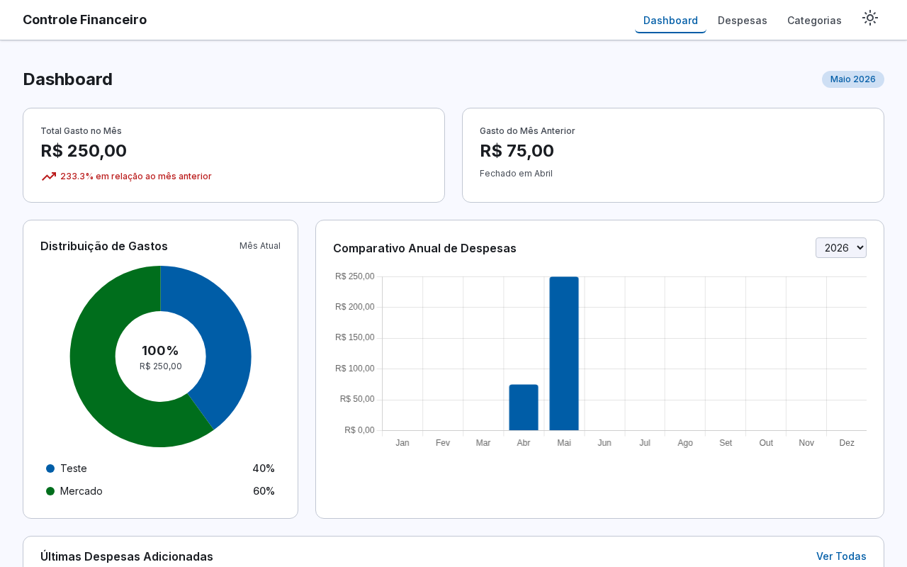
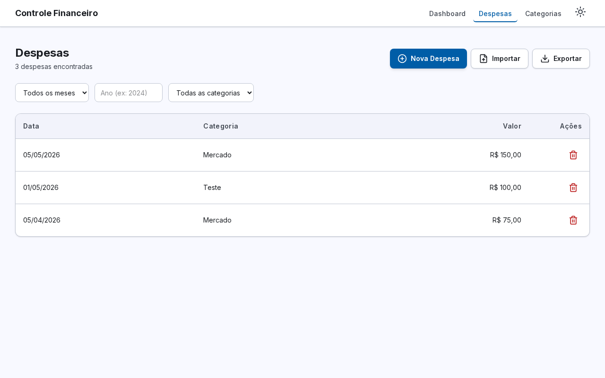
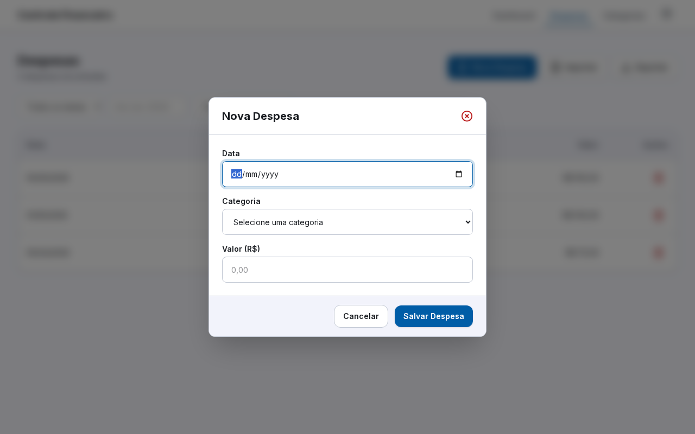
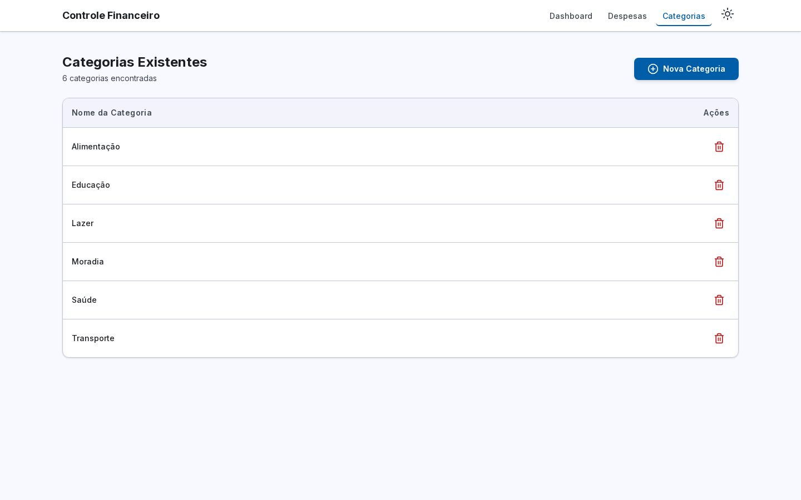
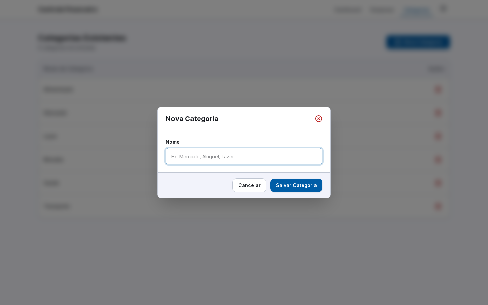

# Controle Financeiro

Aplicacao de controle financeiro pessoal, com backend em NestJS, frontend em Next.js e testes E2E com Playwright.

## Como a IA foi utilizada no Projeto

O desenvolvimento deste projeto foi inteiramente guiado por IA, utilizando o **Claude Code** como assistente principal. O fluxo adotado segue uma progressão deliberada: do levantamento de requisitos à execução de tarefas concretas, passando por etapas de clareza e especificação técnica.

### 1.1 Layout:

Para a construção do layout, utilizei o [Stitch](https://stitch.withgoogle.com/) (em 28/04/2025), uma ferramenta útil para quem não tem tanta familiaridade com o Figma. Minhas percepções foram:

- **Consumo de tokens:** O limite de 400 tokens diários superou minhas expectativas — foi possível desenvolver 5 telas completas utilizando apenas metade da cota disponível.
- **Design e layout:** A ferramenta apresenta uma tendência à padronização, seguindo uma estrutura base e variando apenas detalhes pontuais entre as telas.
- **Fluxo de trabalho:**
  - _Ponto positivo:_ Demonstra boa compreensão do escopo inicial, sugerindo melhorias coerentes com a proposta.
  - _Ponto negativo:_ Ocasionalmente sugere funcionalidades fora do escopo solicitado, como menus de relatórios e configurações.
  - _Aderência ao escopo:_ Tive dificuldade em restringir as ações da IA. Mesmo solicitando explicitamente que o fluxo de login fosse ignorado, a ferramenta insistiu em criar elementos como avatar de usuário e telas de autenticação.

### 1.2 Base do Projeto:

Para o inicio do projeto já foi definido uma base na pasta apps/backend que já tinha a instalaçao do NestJS, na pasta apps/frontend já tinha o NextJS, e na pasta apps/e2e já possui o playright para testes.

Foi tomada essa decisão, pois sem um projeto básico eu notei que a IA gastava token procurando uma versão, e perdia muito tempo com o docker-compose para conectar os dois projetos, e ganhei produtividade entregando essa etapa já pronta.

### 1.3 Escolhas das skill

Este projeto foi desenvolvido com o auxilio das seguintes Skills:

#### nestjs-best-practices

**Fonte:** `kadajett/agent-nestjs-skills`

Guia de boas praticas e padroes de arquitetura para aplicacoes NestJS em producao. Utilizada para garantir:

- Organizacao por feature modules
- Injecao de dependencias via construtor
- Tratamento de erros com filtros e excecoes HTTP
- Validacao de entrada com `class-validator`
- Seguranca com guards de autenticacao e autorizacao
- Desempenho com caching e queries otimizadas

#### nestjs-code-review

**Fonte:** `giuseppe-trisciuoglio/developer-kit`

Skill de code review estruturado para aplicacoes NestJS. Utilizada para:

- Revisao de controllers, services e modules
- Validacao de padroes de injecao de dependencias
- Verificacao de seguranca (guards, DTOs, pipes)
- Avaliacao de cobertura de testes
- Geracao de relatorio de revisao com severidade (Critical, Warning, Suggestion)

#### playwright-best-practices

**Fonte:** `currents-dev/playwright-best-practices-skill`

Guia abrangente de boas praticas para testes com Playwright. Utilizada para:

- Estrutura de testes E2E com Page Object Model (POM)
- Uso de locators semanticos e estaveis
- Configuracao de fixtures e hooks
- Isolamento de estado entre testes
- Configuracao de CI/CD e execucao em Docker
- Depuracao de testes flakey

#### rest-api-design

**Fonte:** `aj-geddes/useful-ai-prompts`

Guia de design de APIs RESTful seguindo boas praticas de mercado. Utilizada para:

- Modelagem de recursos com nomes no plural e substantivos
- Uso correto de metodos HTTP (GET, POST, PUT, DELETE)
- Retorno de status codes adequados
- Paginacao, filtros e ordenacao de colecoes
- Documentacao com OpenAPI/Swagger
- Versionamento de API

#### 1.4 Arquivo inicial

Tudo começa com o arquivo `prompt_inicial.md`, que concentra as principais informações do produto antes de qualquer linha de código ser escrita. Ele funciona como um briefing estruturado entregue à IA.

### 2. Criação do PRD (Product Requirements Document)

Com o prompt inicial como base, a IA gerou o PRD usando o template em `templates/prd-template.md`. Nessa etapa, a IA identificou pontos que não estavam completamente claros no briefing e fez perguntas objetivas para resolvê-los antes de prosseguir, como:

- Quais campos são obrigatórios no cadastro de despesas?
- O CSV de importação segue algum formato específico?
- Os gráficos devem refletir o mês atual ou um período configurável?

Esse ciclo de pergunta e resposta gerou um PRD completo e sem lacunas, que serviu como contrato de funcionalidades para as etapas seguintes.

### 3. Tech Spec (Especificação Técnica)

A partir do PRD aprovado, a IA produziu a especificação técnica com base no template `templates/techspec-template.md`. Essa etapa traduziu os requisitos de negócio em decisões de implementação:

- Modelagem do banco de dados (entidades, relacionamentos, migrações)
- Contrato da API REST (rotas, métodos HTTP, payloads e status codes)
- Estrutura de componentes do frontend e integração com a API
- Estratégia de testes: unitários com Jest no backend, E2E com Playwright
- Configuração do ambiente com Docker Compose

A tech spec funcionou como um plano de execução detalhado, reduzindo retrabalho e garantindo coerência entre backend e frontend.

### 4. Execução de Tarefas

Com PRD e tech spec em mãos, o desenvolvimento foi dividido em tarefas de alto nível (listadas em `tasks/prd-controle-financeiro`) e cada tarefa foi detalhada individualmente com o template `templates/task-template.md`. A IA executou as tarefas de forma sequencial. Cada tarefa entregue foi revisada antes de avançar para a próxima, mantendo o projeto alinhado com o que foi especificado desde o início.

No decorrer das das tarefas notei:

- Em alguns momentos a tarefa estava entregue, mas o projeto nem buildava
- Falava que concluiu a tarefa, mas não marcava o check do arquivo, precisando solicitar para revisar, alguns momentos faltava alguma parte do código.
- Antes de executar as task de e2e, executei o projeto e percebi que as funcionalidades não estava funcionando, dessa forma conclui a importancia do teste e2e.
- No teste e2e, no primeiro momento eu estava tentando desenvolver sem skill, mas notei que estava gastando muito token e entregando pouco.
- No teste e2e, o banco de dados é o sqlLite, notei uma dificuldade para tratar com permissão do arquivo.
- Mesmo passando um layout para o frontend, ocorreu grandes diferenças, foi necessário realizar correções, como solicitar para adicionar os icones, e depois solicitei a revisão do layout pela `tasks/prd-controle-financeiro/LAYOUT_PLAN.md`.
- Depois de solicitar todas as correções, foi solicitado para gerar uma task para criação do template dark e a a task está em `tasks/prd-controle-financeiro/task_template_dark.md`.

## Estrutura do Projeto

```
apps/
  backend/    # API REST com NestJS + SQLite
  frontend/   # Interface com Next.js + Tailwind CSS
  e2e/        # Testes end-to-end com Playwright
```

## Como Executar

### Pre-requisitos

- Docker
- Docker Compose

### Subir os servicos

Execute na pasta `apps/`:

```bash
docker-compose up --build
```

- Backend disponivel em `http://localhost:3000`
- Frontend disponivel em `http://localhost:3001`

### Testes E2E (Playwright)

O Playwright sobe o backend e o frontend automaticamente antes de rodar os testes.

```bash
cd apps/e2e

# Instale as dependencias (primeira vez)
npm install
npx playwright install chromium

# Reseta o banco isolado de e2e
npm run db:reset

# Executa os testes
npm test

# Opcoes adicionais
npm run test:headed   # abre o navegador visualmente
npm run test:ui       # abre a UI interativa do Playwright
npm run report        # abre o relatorio HTML na porta 9300
```

> O banco de dados utilizado nos testes E2E e isolado (`data/control.e2e.sqlite`) e zerado a cada execucao de `db:reset`.

---

## Telas

### Dashboard



### Gerenciamento de Despesas



### Modal Nova Despesa



### Gerenciamento de Categorias



### Modal Nova Categoria


